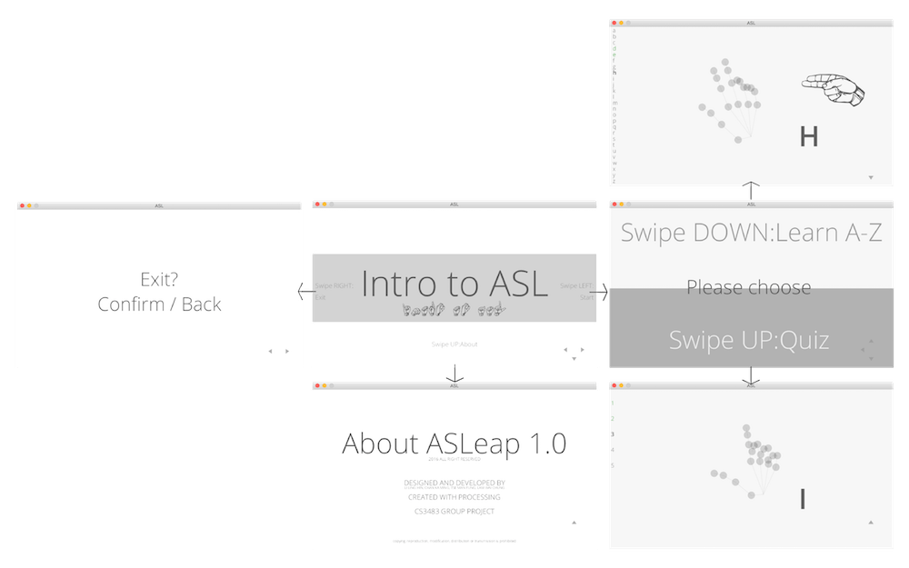

# ASLeap

Demo on YouTube

> ASLeap is a `Leap Motion` enabled application, written in `Processing`, which is designed to teach ASL (American Sign Language), targeting communities that want or needs to learn basic ASL, from relatives/friends of deaf kids/people to the deaf themselves who are novices in ASL. It strives to bring a playful and interactive means of introduction to beginners, to get intrigued and inspired, hence delve deeper later.

## Inspiration
I bought the LeapMotion simply because it looks something straight out of an Iron Man movie. It turned out to be useful for UI/UX and interactive projects. Interestingly, ASL is also gesture-based, which is also treated as a medium for conveying messages. Therefore, my teammates and I developed ASLeap, which implements hand gesture recognition, meanwhile teaches students to perform ASL gestures.

## Design Insight
Other than utilizing data obtained from the LeapMotion in the tutorial and quiz, we designed an intuitive card-like UI, which is reminiscent of Android Wear's UI. The idea was essentially, swipe left to go a level deeper, right to go up a level. Swiping up or down to navigate the content within the same level.

## My Contribution
- UI/UX Design
- Software Prototyping
- Java Programming for LeapMotion
- Research on LeapMotion

Fall 2016
